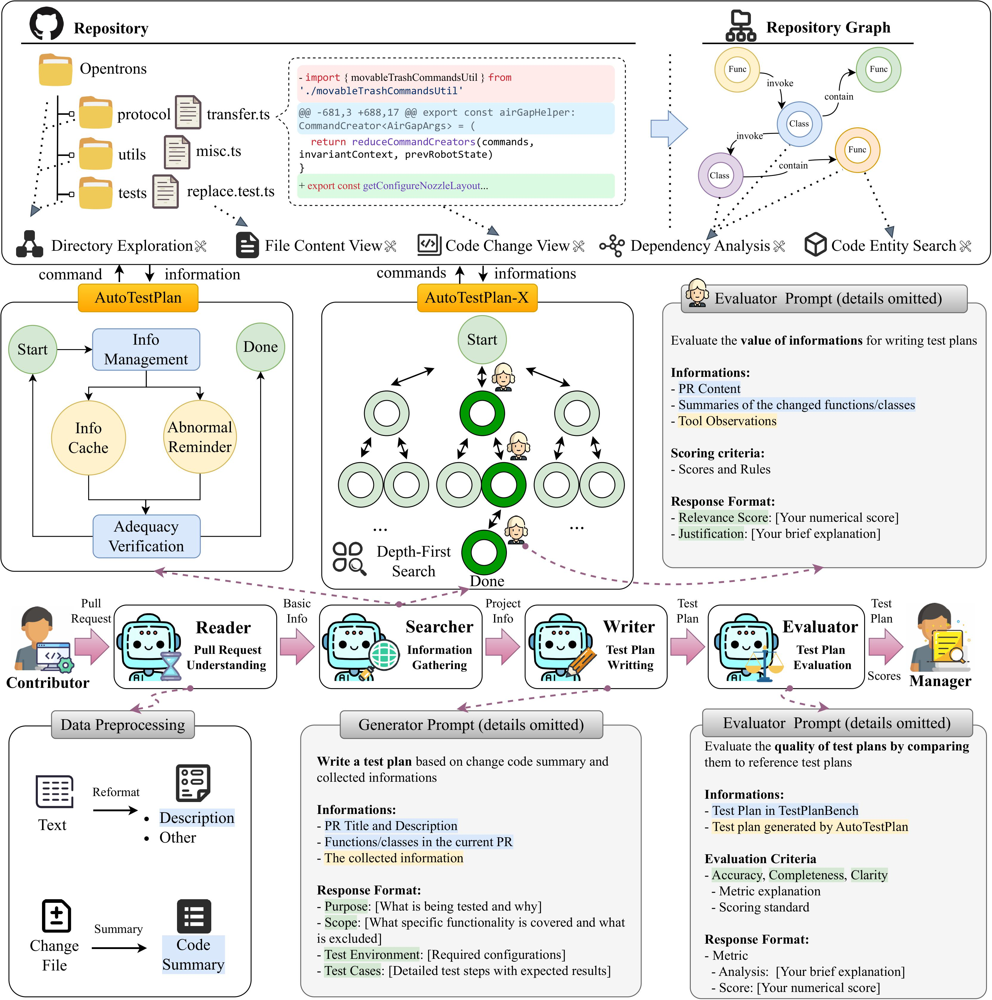

# TestPlanAgent

A agent framework that generates and scores test plans for GitHub Pull Requests.

- Entry point: `run.py`
- Strategies: `InOut`, `Embedding`, `ReAct（AutoTestPlan）`, `TOT（AutoTestPlan-X）`
- Judge: LLM-based evaluator (configurable model)

## Quick Demo

<video src="source/call_bot_method.mp4" controls width="720"></video>

Workflow narrated in the demo:

- Developer: start the bot entry `bot/test-plan-agent-loop/main.py`.
- Bot: TestPlanAgent starts listening for user mentions.
- User: on the target Pull Request, comment `@testplanagent /test-plan`.
- Bot: detects the `@` mention from notifications.
- Bot: begins generating the test plan.
- Bot: after completion, posts the test plan as a comment, mentioning the user.

## Flowchart



## Requirements

- Python 3.10+
- pip

Install dependencies:

```bash
pip install -r requirements.txt
```

## Setup

1) GitHub API Token (required)

- You need a GitHub Personal Access Token to read PR data and diffs. Set it as an environment variable:

```bash
export GITHUB_TOKEN=your_github_token_here
```

2) LLM API (required)

`tasks/BaseTask.py` calls an OpenAI-compatible Chat Completions endpoint in `BaseTask.llm()`. The config must provide:

- `Agent.api_key`
- `Agent.url` (the base URL for a Chat Completions API like `/v1/chat/completions`)

Currently, `run.py/generate_config()` comments out these two fields. Before running, ensure they are present in the config or passed from CLI. For example in `run.py`:

```python
        'Agent': {
            'diff_url': diff_url,
            'PR_url': pr_url,
            'llm_model': llm_model,
            'api_key': api_key,      # enable this
            'url': llm_url,          # key must be 'url' to match BaseTask.llm
            'output_dir': f'{os.path.join(output_dir, strategy, repo, "Test-Plan")}',
            'output_file_name': output_file_name,
            'strategy': strategy
        },
```

Then provide values via `--api-key` and `--llm-api` when running.

## Quick Start (using `run.py`)

Input can be either a single PR URL or a file containing multiple PR URLs (one per line).

PR URL format (GitHub REST):

```
https://api.github.com/repos/{org}/{repo}/pulls/{pr_number}
```

An example list is provided in `data/PR/PR_URL_for_test.txt`.

### 1) Single PR

```bash
python run.py \
  --pr_url https://api.github.com/repos/Opentrons/opentrons/pulls/16571 \
  --model gpt-4o \
  --judge-model claude-3-7-sonnet-20250219 \
  --summary-model gpt-4o \
  --strategy ReAct \
  --output-dir ./result \
  --api-key $OPENAI_API_KEY \
  --llm-api https://api.openai.com/v1/chat/completions \
  --score True
```

### 2) Batch (optional multi-threading)

```bash
python run.py \
  --pr_url ./data/PR/PR_URL_for_test.txt \
  --model gpt-4o \
  --judge-model claude-3-7-sonnet-20250219 \
  --summary-model gpt-4o \
  --strategy ReAct \
  --output-dir ./result \
  --api-key $OPENAI_API_KEY \
  --llm-api https://api.openai.com/v1/chat/completions \
  --multi-threading True \
  --max-workers 10
```

Common flags:

- `--pr_url`: a single PR URL or a file path containing multiple PR URLs
- `--model`: generator LLM model (e.g., `gpt-4o`, `qwen2.5-coder-32b-instruct`)
- `--judge-model`: judge LLM model
- `--summary-model`: code summarization LLM model
- `--strategy`: `InOut` | `Embedding` | `ReAct` | `TOT` (default: `ReAct`)
- `--output-dir`: base output directory (default: `./result`)
- `--score`: whether to score the generated test plan (default: True)
- `--multi-threading`: process multiple PRs concurrently (default: False)
- `--max-workers`: number of worker threads when multi-threading

Tip: to only score an existing test plan, use `--skip-generation True --test-plan-path <path>`.

## Output Structure

`run.py` writes outputs under `--output-dir`, organized by strategy and repo:

```
result/
  ReAct/
    <repo-name>/
      Test-Plan/
        <llm_model>_<pr_number>.json         # generated test plan and ReAct trajectory
      PR-Content/
        <pr_number>_PR_body.json             # structured PR content cache
      scores/
        ...                                  # judge scores
  ...

result/<strategy>/<repo>/<llm>_<judge>_result.json  # aggregated results per run
```

## Project Structure (key parts)

- `run.py`: entry point for parsing CLI args, building config, generating and scoring
- `tasks/`: four strategies and the `Judge`
  - `tasks/task_factory.py`: create tasks by strategy
  - `tasks/BaseTask.py`: shared logic (LLM calls, saving outputs)
- `utils/tools.py`: GitHub PR fetching and helper tools (expects `GITHUB_TOKEN`)
- `prompt/`: prompts for strategies and judge
- `data/PR/PR_URL_for_test.txt`: sample PR list

## Notes & FAQ

- Provide a valid GitHub token and LLM API info; otherwise requests/inference will fail.
- Ensure `generate_config()` in `run.py` writes `Agent.api_key` and `Agent.url` (exact key `url`), which `BaseTask.llm()` reads.
- If you use a self-hosted OpenAI-compatible gateway, it must implement Chat Completions and return `choices[0].message.content`.
- Some strategy tools rely on a code knowledge graph (`CKG/<repo>_graph.pkl`). If missing, related capabilities will be limited.

